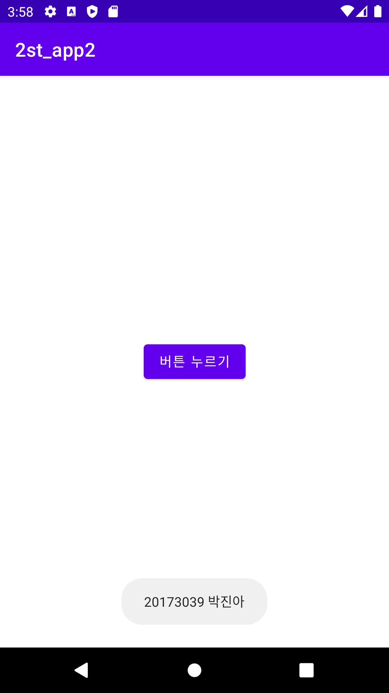
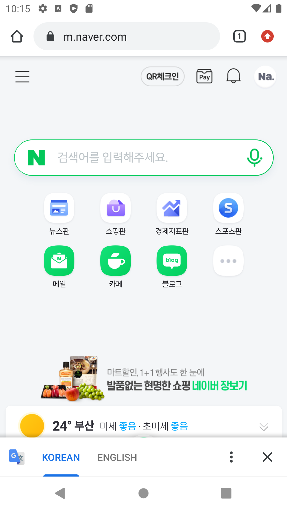
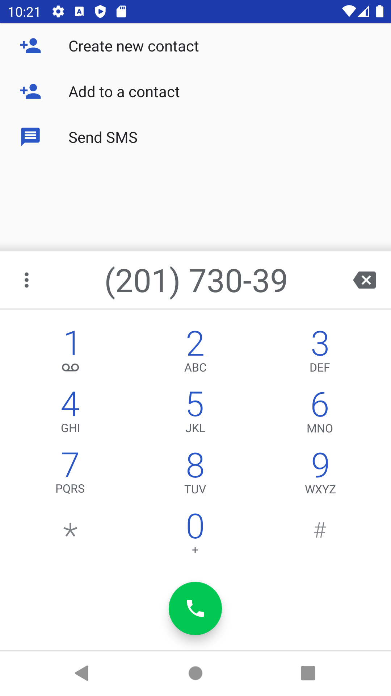

# 캡스톤디자인 안드로이드맵프로그래밍

## 1주차

## 2주차  
  - Github 사용법
  - 안드로이드앱 프로그래밍 시작
    - Toast 알림
    - AVD 시작하기
   
</img>   

## 3주차
   - 네이버화면
   - 전화번호 입력창
   
</img>
</img>

## 4주차 
 - 물건 제품의 사진만으로도 어디서 파는지 사이트 나오는 앱
