# 캡스톤디자인 안드로이드맵프로그래밍

## 1주차

## 2주차  
  - Github 사용법
  - 안드로이드앱 프로그래밍 시작
    - Toast 알림
    - AVD 시작하기
   
</img>   

## 3주차
   - 네이버화면
   - 전화번호 입력창
   
</img>
</img>

## 4주차 
 - 물건 제품의 사진만으로도 어디서 파는지 사이트 나오는 앱

## 5주차
 - 이미지 바꾸기 버튼
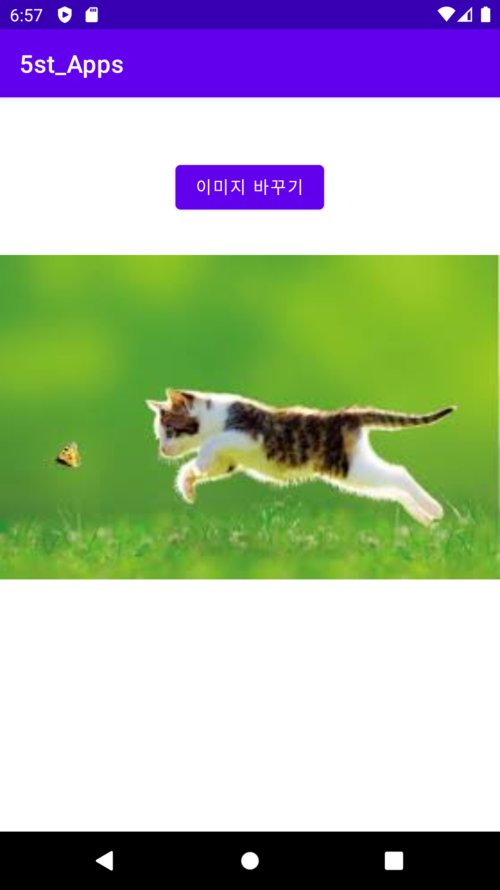</img>
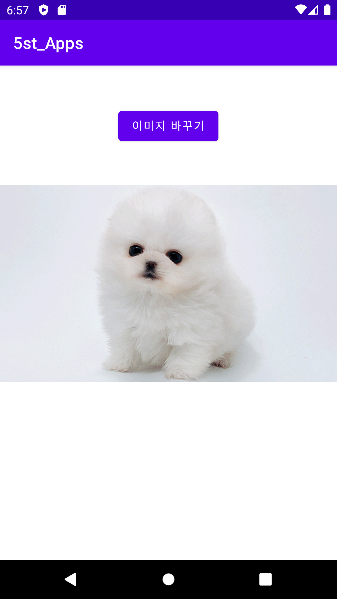</img>

## 6주차
 - 두개의 버튼 추가삽입
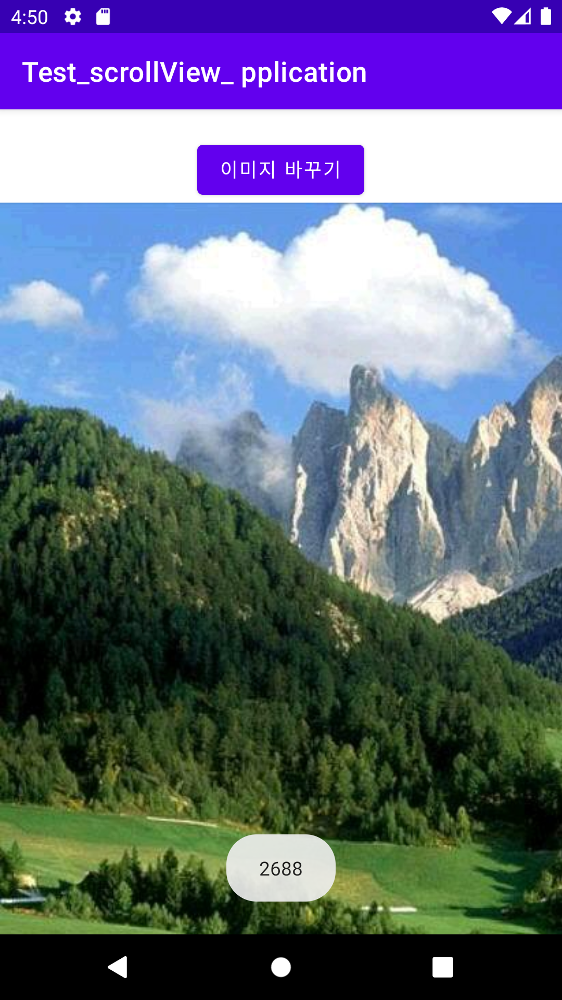</img>
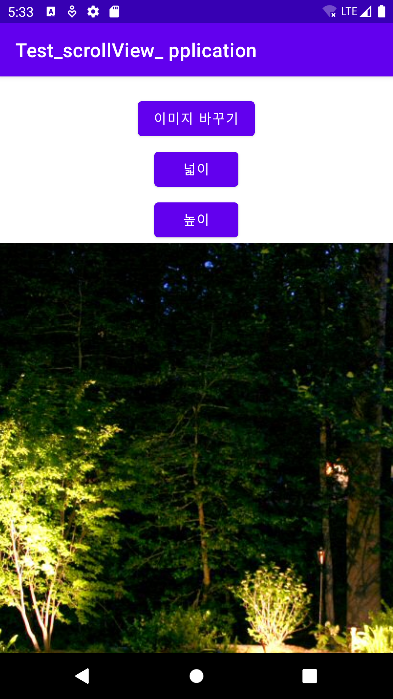</img>
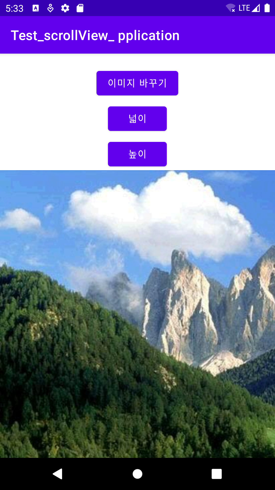</img>

## 9주차
 - 캡스톤디자인
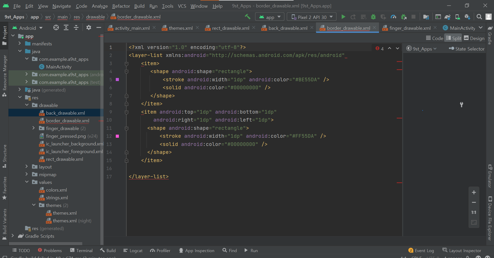</img>

## 10주차
 - 안드로이드앱프로그래밍
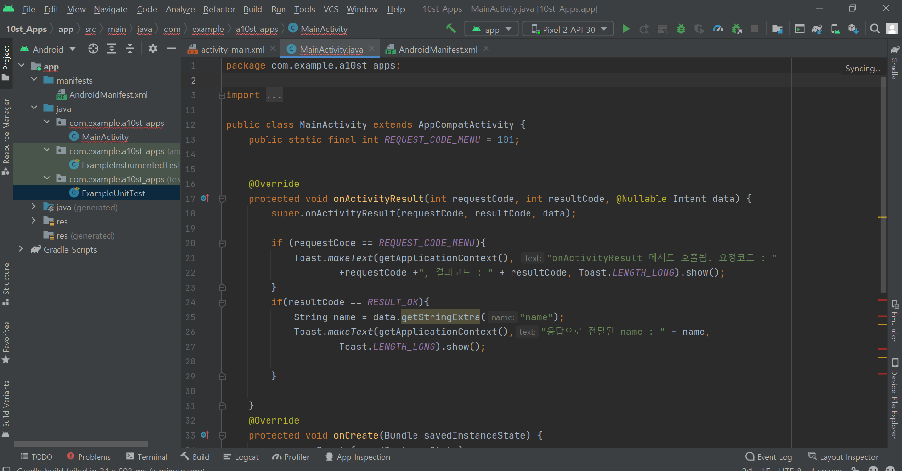</img>

## 11주차
 - 웹요청하기
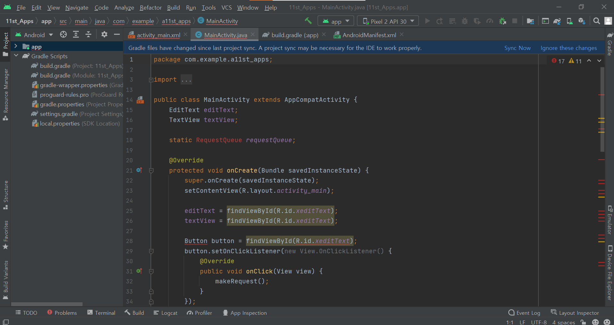</img>
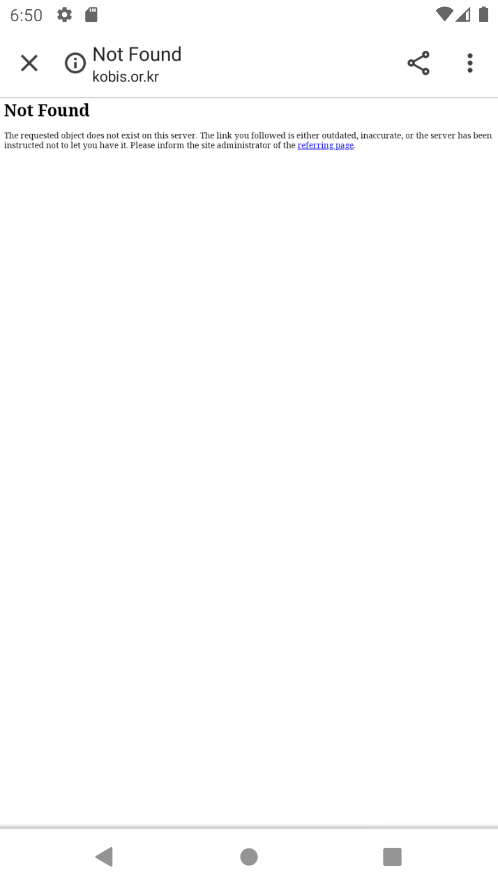</img>

## 12주차
 - 리싸이클러뷰
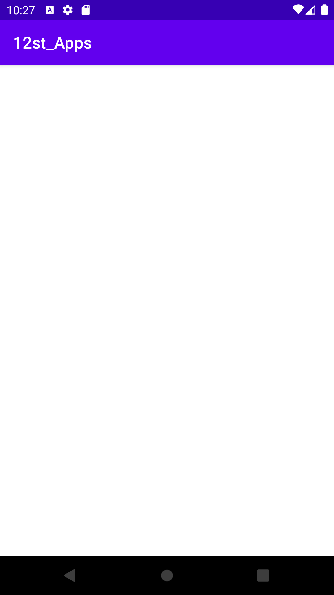</img>

## 13주차
 - 영화이름, 관객수, 영화순위 출력
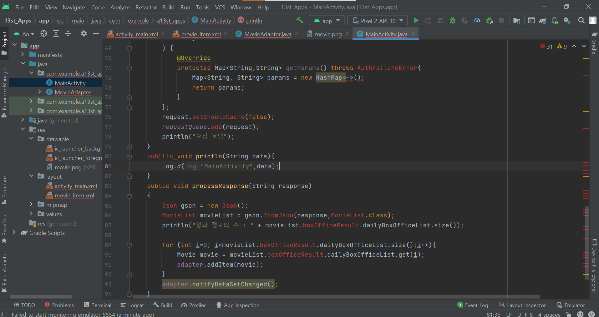</img>
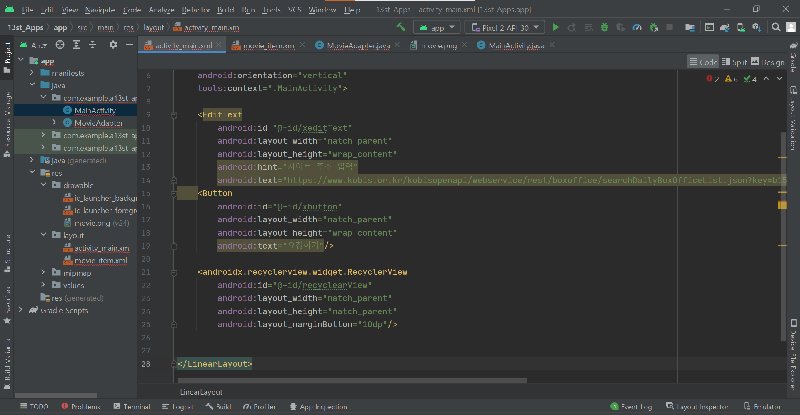</img>
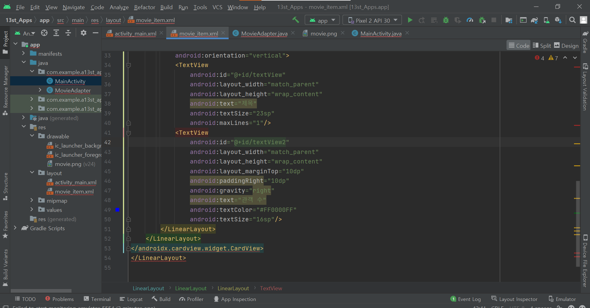</img>
                                  
                                  

